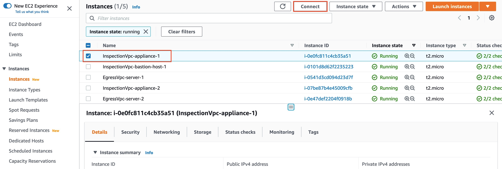
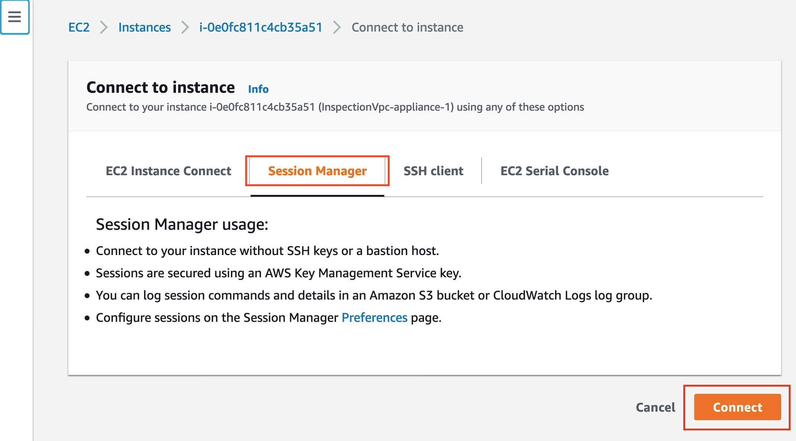
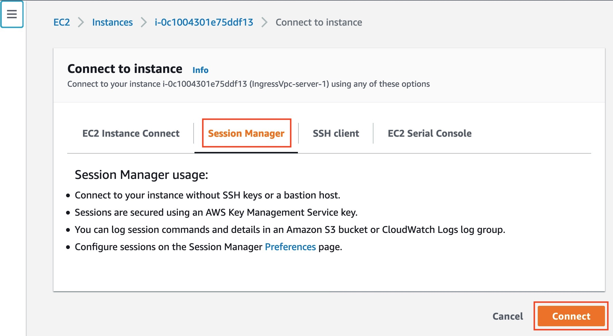
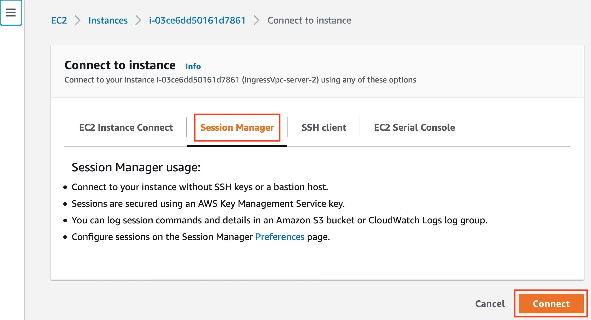
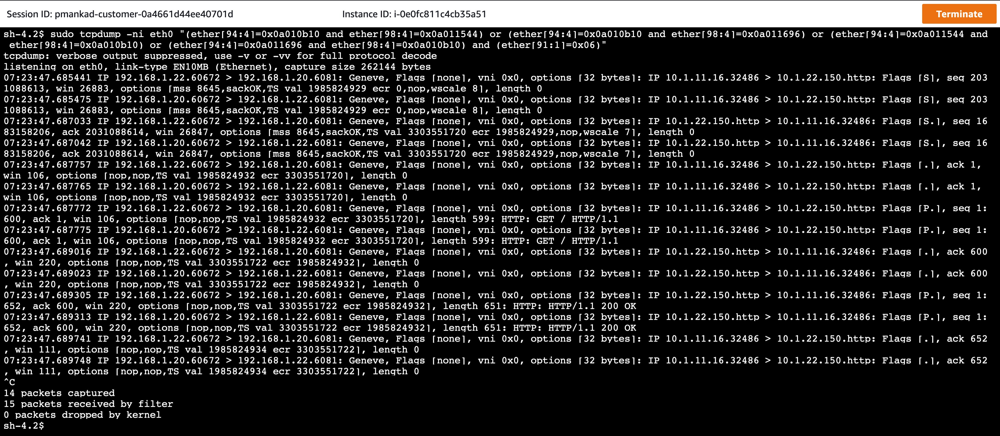

## AWS GWLB + VPC Routing Enhancement + ALB Validation:

### Welcome

* This section walks you through steps to validate ingress traffic inspection with ALB - using VPC routing enhancemnts and GWLB endpoint.

### Testing:

1. Using Session Manager, connect to Appliance 1 running in Inspection VPC:


*Figure 1: Select appliance 1 and click on Connect*


*Figure 2: Select Session Manager and click on Connect*


*Figure 3: Appliance 1*

2. Using Session Manager, connection to Server 1 and Server 2 running in Ingress VPC:


*Figure 7: Select server 1 and click on Connect*


*Figure 8: Select Session Manager and click on Connect*


*Figure 9: Server 1*


*Figure 10: Select server 2 and click on Connect*


*Figure 11: Select Session Manager and click on Connect*


*Figure 12: Server 2*

3. Verify the IP address for the servers:


*Figure 13: Server 1 IP address*


*Figure 14: Server 2 IP address*

4. Capture GENEVE traffic using tcpdump. 

The following tcpdump command filters traffic based inside packet source and destination IP and protocol.

```bash
sudo tcpdump -ni eth0 "(ether[94:4]=0x0a010b10 and ether[98:4]=0x0a011544) or (ether[94:4]=0x0a010b10 and ether[98:4]=0x0a011696) or (ether[94:4]=0x0a011544 and ether[98:4]=0x0a010b10) or (ether[94:4]=0x0a011696 and ether[98:4]=0x0a010b10) and (ether[91:1]=0x06)"
```

In the above tcpdump command:

  * 0x0a011544 = 10.1.21.68, server 1's IP address
  * 0x0a011696 = 10.1.22.150, server 2's IP address
  * 0x0a010b10 = 10.1.11.16, ALB's AZ1 private IP address


*Figure 15: Capture GENEVE traffic on appliance 1*

5. Access ALB's FQDN:


*Figure 17: Access ALB*

4. Verify traffic being processed by respective appliances


*Figure 18: Verifying Traffic on Appliance 1*

While veryifying traffic on inspection appliance, you notice 2 packets. This is because inspection appliance is set up in an [hairpin mode](../../aws-cli/gwlb/configure_iptables_al2.md). In this mode, it sends all the traffic that it receives from GWLB back to GWLB on same interface.
